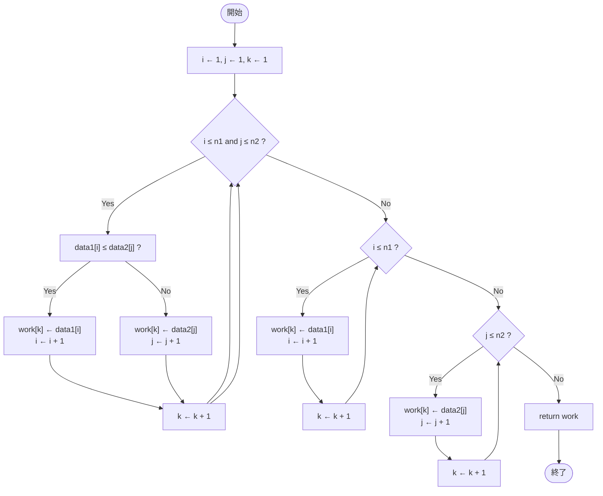

```plaintext
次の問は基本情報技術者試験の問題である。
#1,#2を出力せよ。

#1 プログラム仕様はMarkDown表記のソースコードで表現せよ。その際、プログラムソースコードもMarkDownに含めること。
#2 プログラムソースはアクティビティ図をMermaid表記で示せ。その際、コードブロックにて mermaid を指定することとする。

#問
関数merge は，昇順に整列された整数型の配列data1 及びdata2 を受け取り，これらを併合 
してできる昇順に整列された整数型の配列を返す。


#プログラム
〇整数型の配列: merge( 整数型の配列: data1, 整数型の配列: data2)
整数型: n1 ← data1 の要素数
整数型: n2 ← data2 の要素数
整数型の配列: work ← {(n1 ＋ n2) 個の未定義の値}
整数型: i ← 1
整数型: j ← 1
整数型: k ← 1
while ((i ≦ n1) and (j ≦ n2))
if (data1[i] ≦ data2[j])
work[k] ← data1[i]
i ← i ＋ 1
else
work[k] ← data2[j]
j ← j ＋ 1
endif
k ← k ＋ 1
endwhile
while (i ≦ n1)
work[k] ← data1[i]
i ← i ＋ 1
k ← k ＋ 1
endwhile
while (j ≦ n2)
work[k] ← data2[j] 
j ← j ＋ 1
k ← k ＋ 1
endwhile
return work
```

了解です！
以下に #1 と #2 の回答を示します。

---

## #1 プログラム仕様（Markdown表記）

````markdown
# 関数 merge の仕様

## 概要
昇順に整列された整数型の配列 `data1` と `data2` を受け取り、これらを併合して昇順に整列された整数型の配列を返す。

## 入力
- `data1`: 整数型の昇順整列配列
- `data2`: 整数型の昇順整列配列

## 出力
- 昇順に整列された整数型の配列（`data1` と `data2` の併合結果）

## 処理手順（擬似コード）

```plaintext
関数 merge(data1, data2)
    n1 ← data1 の要素数
    n2 ← data2 の要素数
    work ← 要素数 (n1 + n2) の未定義配列
    i ← 1
    j ← 1
    k ← 1

    while (i ≤ n1 and j ≤ n2)
        if data1[i] ≤ data2[j] then
            work[k] ← data1[i]
            i ← i + 1
        else
            work[k] ← data2[j]
            j ← j + 1
        end if
        k ← k + 1
    end while

    while i ≤ n1
        work[k] ← data1[i]
        i ← i + 1
        k ← k + 1
    end while

    while j ≤ n2
        work[k] ← data2[j]
        j ← j + 1
        k ← k + 1
    end while

    return work
end 関数
````


---

## #2 プログラムソースのアクティビティ図（Mermaid表記）



---

もし何か追加で欲しいものや修正点あれば教えてくださいね！

---
```plaintext
関数merge をmerge({2, 3}, {1, 4}) として呼び出すと出力結果は何か。
```
---
関数 `merge({2, 3}, {1, 4})` の動作を追ってみましょう。

---

### 入力

* `data1 = {2, 3}`
* `data2 = {1, 4}`

### 動作ステップ

| i | j | k | work         | 動作                            |
| - | - | - | ------------ | ----------------------------- |
| 1 | 1 | 1 | {}           | 比較: data1\[1]=2 と data2\[1]=1 |
|   |   |   |              | 1 ≤ 2 ではない → work\[1] ← 1     |
|   | 2 | 2 | {1}          | j=2 に進む                       |
| 1 | 2 | 2 | {1}          | 比較: data1\[1]=2 と data2\[2]=4 |
|   |   |   |              | 2 ≤ 4 → work\[2] ← 2          |
| 2 | 2 | 3 | {1, 2}       | i=2 に進む                       |
| 2 | 2 | 3 | {1, 2}       | 比較: data1\[2]=3 と data2\[2]=4 |
|   |   |   |              | 3 ≤ 4 → work\[3] ← 3          |
| 3 | 2 | 4 | {1, 2, 3}    | i=3 → i > n1=2 なので終了          |
| 3 | 2 | 4 | {1, 2, 3}    | data1 の残りなし                   |
| 3 | 2 | 4 | {1, 2, 3}    | data2 の残り: j=2 ≤ 2            |
|   |   |   |              | work\[4] ← data2\[2] = 4      |
| 3 | 3 | 5 | {1, 2, 3, 4} | j=3 → j > n2=2 なので終了          |

---

### 結果

```
{1, 2, 3, 4}
```

---

**つまり、`merge({2, 3}, {1, 4})` の出力は昇順に並んだ `{1, 2, 3, 4}` となります。**
